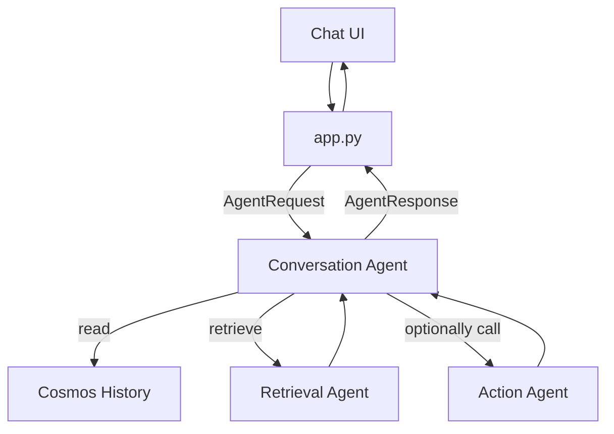

# Agents Architecture Guide

This document explains how to design, extend, and operate AI Agents in this codebase. It is written to be scalable and implementation-agnostic while grounding key references to existing files and modules.

- Repo structure
  - Backend: `backend/`
    - Auth: `backend/auth/` (e.g., `auth_utils.py`, `sample_user.py`)
    - Security: `backend/security/` (e.g., `ms_defender_utils.py`)
    - History/Memory: `backend/history/cosmosdbservice.py`
    - RAG utilities and tests: `backend/rag/` (e.g., `test_rag.py`)
  - API entrypoint: `app.py` (FastAPI/Flask-style app; see `requirements.txt`)
  - Frontend: `frontend/` (React/TypeScript)
  - Infra/CI: `infrastructure/deployment.json`, `.github/workflows/`

Use this as the single source of truth for agent roles, contracts, and how they integrate with the rest of the system.

---

## 1. Goals and Principles

- Simplicity first: clear contracts, small composable agents, minimal coupling.
- Deterministic routing: where possible, use explicit policies before LLM calls.
- Observability by default: log inputs/outputs, tool calls, and errors without leaking sensitive data.
- Security-in-depth: strict authN/Z, least-privileged tool access, safe output handling.
- Portable: configuration via environment variables and typed settings.
- Testable: agents should run in headless (mock) mode for CI.

---

## 2. Core Concepts

- Agent: a component that takes a structured input, optional context/memory, performs reasoning (LLM or rules), optionally invokes tools, and returns a structured output.
- Tool: a capability an agent can call (e.g., search, datastore read/write, RAG retrieval, MS Defender check).
- Policy/Router: decides which agent(s) to use for a request.
- Memory: short-term (conversation turn), mid-term (chat session), long-term (history store like Cosmos DB).
- Orchestrator: coordinates agent execution, retries, parallelization, and aggregation.

---

## 3. Reference Modules in This Repo

- AuthN/Z: `backend/auth/auth_utils.py`, `backend/auth/sample_user.py`
- Security checks: `backend/security/ms_defender_utils.py`
- History store: `backend/history/cosmosdbservice.py`
- RAG experiments/utilities: `backend/rag/test_rag.py`
- API/server: `app.py`
- Frontend UI: `frontend/src/` (chat UI and sidebar management)

These modules provide building blocks for tools and persistence. Agents should not import frontend code; communicate via API DTOs only.

---

## 4. Agent Types and Responsibilities

You can model the system with the following scalable agent taxonomy. Only implement what you need now; the contracts below keep you future-ready.

1) Conversation Agent (Primary)
- Purpose: turn-by-turn assistance for the user in the chat UI.
- Inputs: user message, chat/session ID, selected mode/tools, optional file/context.
- Tools: RAG retrieval, history store, security policy checks.
- Output: assistant message + metadata (citations, tool traces, safety flags).

2) Retrieval Agent (RAG)
- Purpose: retrieve relevant chunks from your knowledge stores.
- Inputs: query string + filters.
- Tools: vector/keyword search, metadata filters.
- Output: ranked passages with source and score.

3) Action Agent (Executor)
- Purpose: run concrete operations (e.g., call MS Defender utilities, trigger back-office tasks).
- Inputs: structured command from Conversation Agent.
- Tools: `backend/security/ms_defender_utils.py` and any future integrations.
- Output: operation result or error with structured status.

4) Management Agent (Planner/Router)
- Purpose: choose which agent(s)/tools to engage and in what order.
- Inputs: user intent classification + policy.
- Output: routing plan; may call Conversation Agent or Action Agent.

---

## 5. Agent Contracts (Python Pydantic-style examples)

Use clear DTOs so orchestration and logging remain consistent regardless of the underlying LLM or tool.

```python
from typing import List, Optional, Dict, Any
from pydantic import BaseModel

class Message(BaseModel):
    role: str  # "user" | "assistant" | "system" | "tool"
    content: str
    name: Optional[str] = None
    tool_call_id: Optional[str] = None

class ToolCall(BaseModel):
    name: str
    arguments: Dict[str, Any]

class AgentRequest(BaseModel):
    session_id: str
    messages: List[Message]
    instructions: Optional[str] = None
    tools: List[str] = []  # tool names allowed
    context: Dict[str, Any] = {}

class AgentResponse(BaseModel):
    messages: List[Message]
    tool_calls: List[ToolCall] = []
    citations: List[Dict[str, Any]] = []
    safety: Dict[str, Any] = {}
    usage: Dict[str, Any] = {}
```

Keep the request/response payloads small and stable. Add fields via backward-compatible extensions.

---

## 6. Tools Design

- Define one Python module per tool with a minimal public interface. Example categories:
  - History: use `backend/history/cosmosdbservice.py` to read/write chat records.
  - Security: use `backend/security/ms_defender_utils.py` (guardrails, checks, or queries).
  - Retrieval: wrap your RAG implementation (vector search, BM25), co-locate config in `backend/rag/`.
- Validate and sanitize inputs at the tool boundary.
- Return typed results and never raise raw exceptions to agents; use structured errors.

Tool skeleton example:
```python
class ToolError(Exception):
    def __init__(self, code: str, message: str):
        super().__init__(message)
        self.code = code

class RagRetriever:
    def __init__(self, index):
        self.index = index

    def query(self, text: str, k: int = 5):
        if not text:
            raise ToolError("INVALID_INPUT", "query text is required")
        # return [{"text": ..., "source": ..., "score": ...}, ...]
        return []
```

---

## 7. Orchestration & Flow

- HTTP layer (`app.py`) receives a chat turn, maps it to `AgentRequest`, and invokes the Conversation Agent.
- Conversation Agent may:
  1) Read history (Cosmos) for session context.
  2) Call RAG to fetch relevant passages.
  3) Produce a draft, optionally call tools (e.g., MS Defender) via Action Agent.
  4) Produce final `AgentResponse` and persist turn to history.
- Use idempotent request IDs for safe retries.
- Enforce timeouts and maximum tool call depth per request.

---

## 8. Memory Strategy

- Short-term: in-request context window (latest N messages).
- Mid-term: session-level store via `backend/history/cosmosdbservice.py`.
- Long-term: knowledge sources (RAG).
- Redaction: never store API keys, tokens, or PII beyond what’s necessary.
- Compaction: periodically trim or summarize long sessions.

---

## 9. Prompting & Safety

- Maintain prompts as versioned strings (or templates) with an explicit schema contract.
- Inject explicit tool use instructions and expected JSON outputs for Action/RAG tools.
- Safety checks:
  - Pre-exec: validate tool arguments and enforce allowlists.
  - Post-exec: check outputs for leakage and sanitize before returning to the client.

---

## 10. Configuration

- Use environment variables and a typed settings module (example):
  - DB settings (Cosmos) for history.
  - RAG index connection (endpoint, key, top_k).
  - Security integration tokens (e.g., MS Defender) via secret store.
- Keep defaults safe; fail fast if required variables are missing.

---

## 11. Testing Strategy

- Unit tests: mock LLM and tools, validate agent contracts.
- Integration tests: run `app.py` in test mode, hit endpoints with synthetic data.
- Determinism:
  - Seed randomness, fix top_p/temperature in test configs.
  - Use snapshot tests for message formatting.

---

## 12. Observability

- Request ID: propagate in logs across API → Agent → Tools.
- Metrics: count tool calls, latency, token usage, error rates.
- Traces: optional spans for RAG and external API calls.
- Redact secrets in logs; prefer structured logging (JSON).

---

## 13. Frontend Integration

- The chat UI (`frontend/src/components/ChatInterface.tsx`) sends user input to the backend and renders messages.
- Sidebar (`frontend/src/components/Sidebar.tsx`) includes per-chat actions (rename/share/delete); the backend should expose APIs for these operations.
- Keep API DTOs aligned with `AgentRequest`/`AgentResponse` to simplify rendering and telemetry.

---

## 14. Deployment

- Backend served via `gunicorn`/`uvicorn` style (see `gunicorn.conf.py`, `requirements.txt`).
- Frontend is built and deployed separately (see `.github/workflows/`).
- Environment parity between dev/stage/prod is critical; prefer IaC (`infrastructure/deployment.json`).

---

## 15. Extending Agents (Playbook)

1) Define the capability
   - What user problem does it solve? Which tool(s) are required?
2) Add/extend a Tool module
   - New `backend/.../<tool>.py`, typed interface, exceptions.
3) Update the Orchestrator/Router
   - Map intents → agent/tool plans; keep policy files versioned.
4) Update the Conversation Agent
   - Add tool calling logic behind a feature flag or config.
5) Add configuration
   - Env vars, secrets, default limits (timeouts, top_k, etc.).
6) Add tests
   - Unit + integration; mock external calls.
7) Document
   - Update this file with the new tool/agent and contracts.

---

## 16. Common Pitfalls & Patterns

- Avoid tight coupling between agents and specific UI components.
- Always validate tool input and return structured errors.
- Control recursion: cap tool call depth per request.
- Use small, composable prompts and keep them versioned.
- Consolidate retries and backoff in the orchestrator, not in tools.

---

## 17. Minimal Example (Pseudo-flow)



---

## 18. Ownership & Next Steps

- Backend Agents: responsible team/owner TBD
- Frontend Contracts: ensure DTOs stay stable across releases
- Next steps:
  - Extract formal DTOs into a shared module
  - Add baseline unit tests for agent request/response
  - Standardize logging middleware with request IDs

This guide should equip you to extend and operate agents in this codebase in a scalable, secure, and testable way. If you add new agents or tools, update the relevant sections above.
