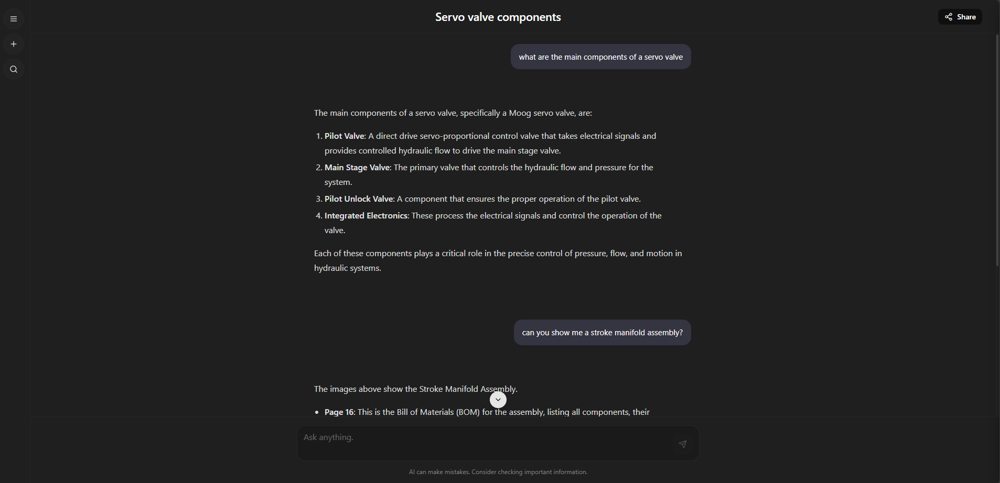
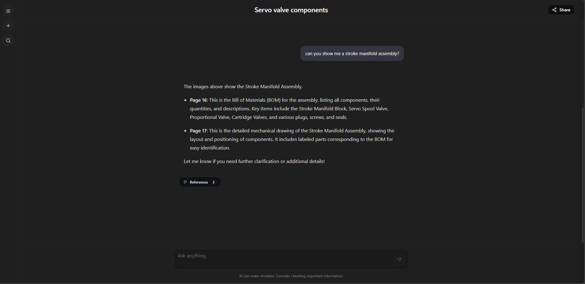
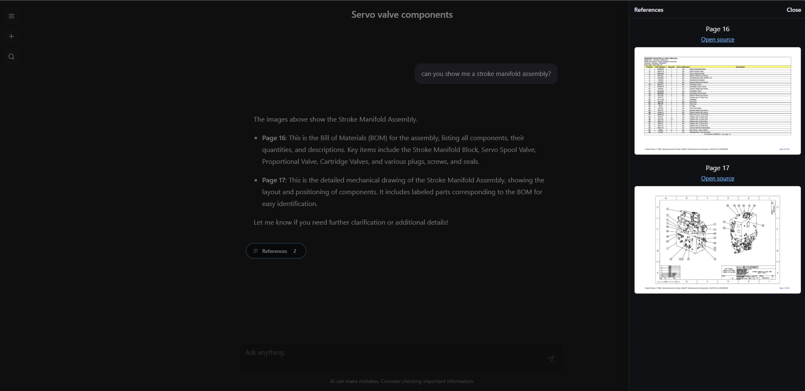

# Maintenance Assistant Chatbot

An end-to-end agentic assistant that helps maintenance technicians investigate issues, locate parts, and review documentation for the HyPET300 4.0 injection molding platform. The project combines a LangGraph-powered reasoning loop, Azure AI services, and a React front-end to deliver fast, citation-backed answers.

## Key Capabilities
- Conversational maintenance support tuned for plant-floor scenarios.
- ReAct-style research loop orchestrated with LangGraph, including tool budgeting and self-reflection.
- Hybrid retrieval (Azure AI Search + Cohere rerank) over internal maintenance manuals and SOPs.
- Mechanical drawing workflow: page lookup from a curated table of contents, then on-demand page renders from Azure Blob Storage.
- Optional conversation history stored in Azure Cosmos DB with feedback hooks.
- Streaming responses to the UI, including inline citation previews for drawing snapshots.

## System Architecture
- **Frontend**: Vite + React single-page app served from `static/` in production. Tailored chat layout with maintenance-specific branding hooks via environment-driven UI settings.
- **Backend**: Quart application (served by Uvicorn/Gunicorn) providing chat, history, and asset routes. Handles authentication, streaming, and LangGraph session management.
- **Agent graph**: Defined in `backend/custom_langgraph` and `backend/agents/`. Uses Azure OpenAI for reasoning, LangChain tool bindings, and per-turn tool budgets enforced in `langgraph_agents.py`.
- **Knowledge retrieval**: `retrieve_and_rerank` tool combines Azure Search hybrid recall with optional Cohere reranking.
- **Mechanical drawings**: `page_locator` infers drawing/BOM page ranges from a markdown TOC, and `drawing_image_links` issues short-lived SAS links via Azure Storage for visual inspection.
- **Persistence and telemetry**: Cosmos DB for chat history, LangSmith (optional) for tracing, plus configurable logging.

## Prerequisites
- Python 3.11+
- Node.js 18+ (for the Vite/React frontend)
- Azure resources:
  - Azure OpenAI (chat and embedding deployments)
  - Azure AI Search index populated with maintenance documents
  - Azure Storage container that holds pre-rendered drawing images
  - (Optional) Azure Cosmos DB for conversation history
- Cohere API key (optional) for improved reranking

## Environment Configuration
Create a `.env` file in the project root. Only the keys relevant to your deployment need to be populated; the example below shows the most common variables.

```dotenv
# Core model configuration
AZURE_OPENAI_MODEL=<chat-deployment-name>
AZURE_OPENAI_KEY=<api-key>
AZURE_OPENAI_ENDPOINT=https://<resource-name>.openai.azure.com
AZURE_OPENAI_PREVIEW_API_VERSION=2024-05-01-preview
AZURE_OPENAI_TEMPERATURE=0.0

# Embeddings used by Azure Search
AZURE_OPENAI_EMBEDDING_MODEL=<embedding-deployment-name>
AZURE_OPENAI_EMBEDDING_KEY=<embedding-key>
AZURE_OPENAI_EMBEDDING_ENDPOINT=https://<resource-name>.openai.azure.com
AZURE_OPENAI_EMBEDDING_API_VERSION=2024-05-01-preview

# Azure AI Search (vector + hybrid retrieval)
AZURE_SEARCH_ENDPOINT=https://<search-resource>.search.windows.net
AZURE_SEARCH_KEY=<search-key>
AZURE_SEARCH_INDEX=<index-name>
AZURE_SEARCH_SEARCH_DIMENSIONS=1536

# Mechanical drawing storage (Azure Blob)
AZURE_STORAGE_ACCOUNT=<storage-account>
AZURE_STORAGE_KEY=<storage-key>
AZURE_STORAGE_CONTAINER=<container-name>

# Conversation history (optional)
AZURE_COSMOSDB_ACCOUNT=<cosmos-account>
AZURE_COSMOSDB_ACCOUNT_KEY=<cosmos-key>
AZURE_COSMOSDB_DATABASE=<database>
AZURE_COSMOSDB_CONVERSATIONS_CONTAINER=<container>
AZURE_COSMOSDB_ENABLE_FEEDBACK=false

# Optional integrations
COHERE_API_KEY=<cohere-key>
LANGSMITH_API_KEY=<langsmith-key>
LANGSMITH_PROJECT=maintenance-assistant

# UI customization (optional)
UI_TITLE="Maintenance Agent"
UI_CHAT_TITLE="Maintenance Assistant"
UI_CHAT_DESCRIPTION="Your go-to expert for HyPET300 troubleshooting."
```

> Note: `backend/settings.py` documents additional optional settings, including Prompt Flow, logging, and authentication hooks.

## Running Locally
1. **Create a virtual environment and install backend dependencies**
   ```powershell
   python -m venv .venv
   .\\.venv\\Scripts\\Activate
   pip install -r requirements.txt
   ```
2. **Install frontend dependencies**
   ```powershell
   cd frontend
   npm install
   ```
3. **Start the development stack**
   - In one terminal (with the virtual environment activated):
     ```powershell
     uvicorn app:app --reload --port 50505
     ```
   - In another terminal from `frontend/`:
     ```powershell
     npm run dev
     ```
   The React dev server proxies API calls to `http://localhost:50505`.

4. **Production-style build**
   Run `start.cmd` (Windows) or `start.sh` (macOS/Linux) to install dependencies, build the frontend, copy static assets, and launch the backend with Uvicorn.

## How the Agent Responds
1. User messages enter the LangGraph pipeline (`backend/custom_langgraph/router_graph.py`).
2. The reasoning agent (`backend/agents/langgraph_agents.py`) evaluates whether more evidence is required.
3. Retrieval tools can be invoked in a loop until the tool budget is met:
   - `retrieve_and_rerank` fetches relevant passages.
   - `page_locator` and `drawing_image_links` serve mechanical drawings when requested.
   - `think_tool` enforces explicit reflections between tool calls.
4. Final answers are streamed to the client along with structured citations so the UI can render drawing previews and reference panels.

## Repository Layout
- `app.py` - Quart entry point, routes, and streaming helpers.
- `backend/agents/` - LangGraph agent definition, tools, prompts, and mechanical drawing utilities.
- `backend/custom_langgraph/` - Graph wiring and router logic.
- `backend/history/` - Cosmos DB conversation store implementation.
- `backend/assets/` - Static data such as the mechanical drawing table of contents.
- `frontend/` - React + Vite chat UI.
- `static/` - Production build artifacts served by Quart.

## Testing and Quality
- Python: add unit tests (for example with `pytest`) as needed. No test suite ships by default.
- Frontend: `npm run test` executes Jest tests; `npm run lint` and `npm run prettier` keep the UI codebase consistent.
- Agent tracing: enable LangSmith by setting `LANGSMITH_API_KEY` and `LANGSMITH_PROJECT`.

## Troubleshooting
- **Blank chat window**: verify the frontend build copied into `static/` or run the dev server from `frontend/`.
- **Tool call failures**: ensure Azure Search index and Storage container names match the values in `.env`.
- **Missing drawing previews**: confirm the blob container contains `Husky_2_Mechanical_Drawing_Package-p<page>` blobs and that the storage key has read permissions.
- **Authentication errors**: double-check Azure OpenAI keys and API version (`2024-05-01-preview` minimum).

## License
This project began from Microsoft's Azure OpenAI chat sample but has been heavily customized for maintenance operations.

## Screenshots

**Home Page**


**Open Chat**



**Mechanical Drawing query - with references**



**Opened References sidebar**



